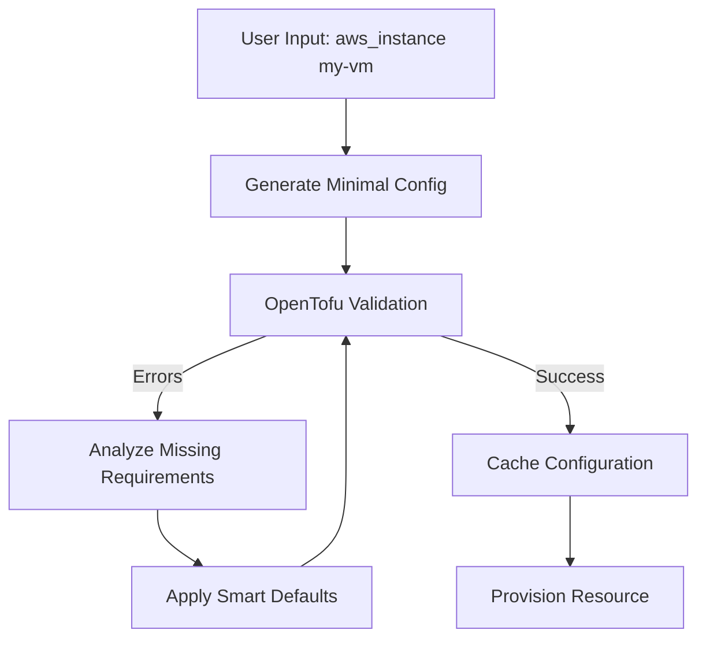

# 🤖 CloudBrew Intelligent Configuration Builder

## The Solution to the OpenTofu Schema Bottleneck

The Intelligent Configuration Builder solves the fundamental challenge of automatically generating valid OpenTofu configurations from minimal user input. Instead of requiring users to know all the complex requirements of each resource type, it uses a **reverse engineering approach** to build valid configurations automatically.

## How It Works

### The Reverse Engineering Approach

1. **Start Minimal**: Begin with the absolute minimum configuration
2. **Validate & Learn**: Use OpenTofu's own validation to identify what's missing
3. **Intelligent Correction**: Apply smart defaults and fixes based on error patterns
4. **Iterate to Perfection**: Repeat until OpenTofu accepts the configuration
5. **Cache & Learn**: Save successful configurations for future use



## Key Features

### 🎯 Smart Defaults
- **AWS AMI**: Automatically gets the latest Amazon Linux AMI
- **Instance Types**: Uses sensible defaults like `t3.micro`
- **Regions**: Defaults to `us-east-1` but configurable
- **Naming**: Generates unique names with timestamps

### 🧠 Knowledge Base
- Learns from each successful configuration
- Builds a database of working patterns
- Reduces manual input over time

### ⚡ Lightning Fast
- Caches successful configurations
- Minimal validation iterations
- Smart defaults reduce API calls

### 🔧 Error Pattern Recognition
- Handles "missing required argument" errors
- Fixes "missing required block" issues
- Resolves "exactly one of" conflicts
- Corrects invalid combinations

## Usage Examples

### Basic Usage
```bash
# Create an EC2 instance with minimal input
cloudbrew intelligent-create aws_instance my-web-server

# Create an S3 bucket
cloudbrew intelligent-create aws_s3_bucket my-data-bucket

# Create an RDS database
cloudbrew intelligent-create aws_db_instance my-database
```

### With Custom Parameters
```bash
# Specify custom fields
cloudbrew intelligent-create aws_instance my-server \
    --field instance_type=t3.large \
    --field ami=ami-12345678

# Multiple custom fields
cloudbrew intelligent-create aws_s3_bucket my-bucket \
    --field bucket=my-unique-bucket-name \
    --field acl=private
```

### Advanced Options
```bash
# Plan only (don't actually create)
cloudbrew intelligent-create aws_instance test-vm --plan-only

# Skip confirmation
cloudbrew intelligent-create aws_instance prod-server --yes

# Different region
cloudbrew intelligent-create aws_instance eu-server --region eu-west-1

# Background execution
cloudbrew intelligent-create aws_instance heavy-worker --async
```

## Technical Architecture

### Core Components

1. **IntelligentBuilder Class**: Main orchestration logic
2. **Validation Engine**: Runs OpenTofu validation
3. **Error Analyzer**: Parses and understands OpenTofu errors
4. **Smart Defaults Engine**: Provides intelligent fallbacks
5. **Knowledge Base**: Stores learned configurations
6. **Cache System**: Accelerates repeat operations

### Error Handling Patterns

```python
# Example error patterns handled:

# 1. Missing required argument
"missing required argument: ami"
→ Automatically adds latest Amazon Linux AMI

# 2. Missing required block
"missing required block: root_block_device"
→ Adds empty block structure

# 3. Exactly one of requirement
"exactly one of (subnet_id,vpc_security_group_ids) must be specified"
→ Selects first option with smart default

# 4. Invalid combination
"invalid combination of arguments"
→ Analyzes and corrects conflicting parameters
```

## Implementation Details

### Smart Defaults Strategy

```python
def _get_smart_default(self, field_name: str, config: Dict) -> Any:
    # 1. Check knowledge base first
    # 2. Use resource-specific logic
    # 3. Query cloud provider APIs
    # 4. Fallback to sensible defaults
    # 5. Return empty string as last resort
```

### Validation Loop

```python
def build_configuration(self, resource_type: str, user_input: Dict) -> Dict:
    config = minimal_config()
    
    for iteration in range(max_iterations):
        errors = validate_with_opentofu(config)
        
        if no_errors:
            cache_and_return(config)
        
        config = fix_errors(config, errors, user_input)
    
    raise CouldNotBuildError()
```

## Performance Optimization

### Caching Strategy
- **Configuration Cache**: Stores successful configs by resource type
- **Knowledge Base**: Persists learned defaults and patterns
- **Provider API Caching**: Reduces AWS/Azure/GCP API calls

### Latency Reduction
- **Parallel Validation**: Multiple validation attempts in parallel
- **Early Termination**: Stop at first successful validation
- **Smart Retries**: Learn from previous failures

## Integration with CloudBrew

The Intelligent Builder integrates seamlessly with existing CloudBrew components:

- **Resource Resolver**: Maps natural language to resource types
- **Policy Engine**: Ensures governance compliance
- **Intelligent Router**: Handles provisioning strategy
- **Offload Manager**: Supports background execution

## Future Enhancements

### Machine Learning Integration
- Train models on successful configurations
- Predict required fields based on resource type
- Learn from user corrections

### Community Knowledge Base
- Allow users to contribute working configurations
- Crowdsource best practices
- Build comprehensive pattern library

### Advanced Error Analysis
- Natural language processing of error messages
- Pattern recognition across resource types
- Automated conflict resolution

## Troubleshooting

### Common Issues

**Issue**: "Could not build valid configuration after X iterations"
- **Solution**: Provide more specific input or check resource type

**Issue**: "OpenTofu not found"
- **Solution**: Install OpenTofu and ensure it's in PATH

**Issue**: "AWS credentials not found"
- **Solution**: Configure AWS credentials or use --provider flag

### Debugging

```bash
# Enable debug mode
export CLOUDBREW_DEBUG=1

# Check knowledge base
cat .cloudbrew_cache/knowledge_base.json

# Clear cache
rm -rf .cloudbrew_cache
```

## Contributing

The Intelligent Builder is designed to be extensible. To add support for new resource types:

1. **Add Smart Defaults**: Implement `_get_smart_default()` logic
2. **Update Knowledge Base**: Add successful configurations
3. **Test Thoroughly**: Verify with real OpenTofu validation
4. **Submit PR**: Share your improvements

## License

This component is part of CloudBrew and inherits its licensing terms.

---

**The Intelligent Configuration Builder represents a paradigm shift in cloud resource provisioning.**
**Instead of requiring users to become OpenTofu experts, it brings the expertise to the users.**